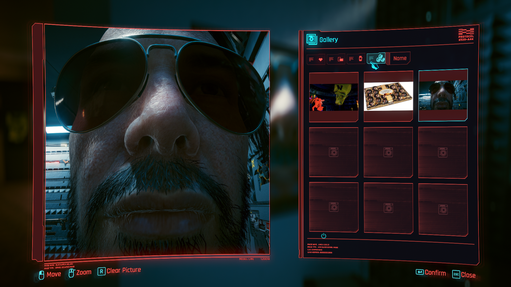

## Cyberpunk2077 - GalleryCustomFilters

## About

This Cyberpunk 2077 mod adds custom filters to the smart frame screenshot selection menu.

> Patch 2.2 added Smart Frames which allow for custom images to be displayed in V's appartments.
> This mod allows other mods to add custom filter rules to better handle screenshots.

A filter for screenshot names comes bundled with the mod.
By default it only sorts screenshots by name. However, with Mod Settings
installed, it's possible to configure it to filter out images that have
the `photomode_` prefix. Moreover, with Codeware installed you can also
enable the search feature to filter screenshots by name.

This mod can also be used by other mods to implement more custom filters.

## Requirements

- [redscript 0.5.27+](https://github.com/jac3km4/redscript)
- [Mod Settings 0.2.8+](https://github.com/jackhumbert/mod_settings) (optional, adds in-game config for built-in filters)
- [Codeware 1.18.0+](https://github.com/psiberx/cp2077-codeware) (optional, adds in-game search for sort by name filter)

## API for Modders

An example of the API's usage can be found in the [r6/scripts/GalleryCustomFilters/SortByName](r6/scripts/GalleryCustomFilters/SortByName) folder.

Classes that must be used to implement a `CustomFilter` are found within [GalleryCustomFilter.reds](r6/scripts/GalleryCustomFilters/GalleryCustomFilter.reds) along with documentation for their methods.
